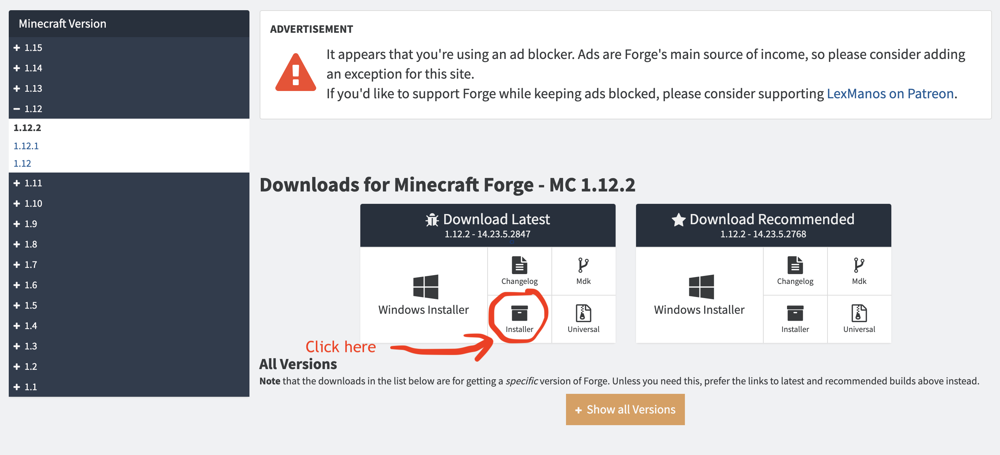
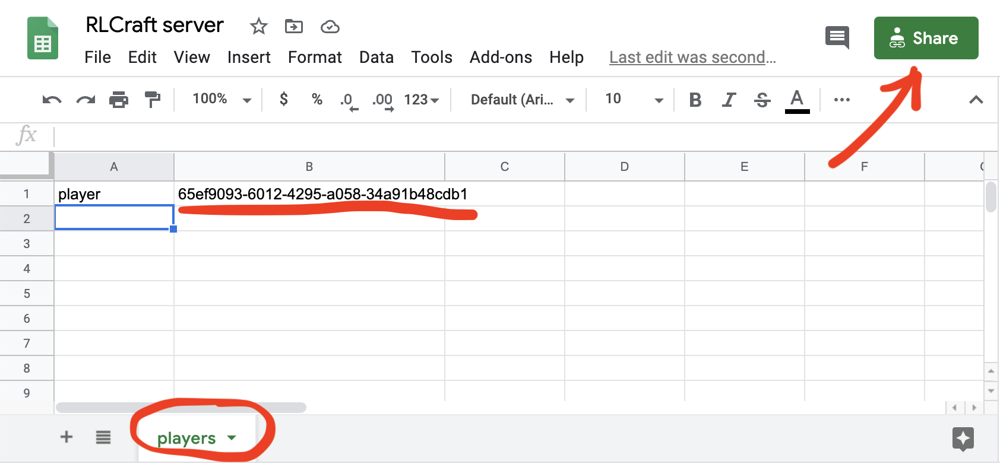
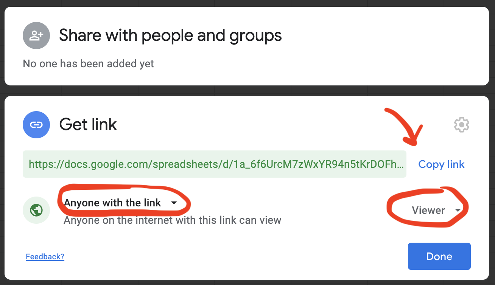

# Dockerfile for a family-and-friend RLCraft server

https://rlcraft.fandom.com/wiki/RLCraft_Wiki

## Features

* Runs server in a screen session
* Server is restarted if it crashes
* Takes rolling backups of world state, one per hour, thinned out to one per day as they age
* Can safely destroy and rebuild the container without losing state
  * Stores world state in volume mounted from host
  * Backs up hourly in volume mounted from host
* Can theoretically use any version of RLCraft (tested on `1.12.2-Beta-2.8.2`)
* Supports adding additional mod packs when building your image
* Supports adding additional resource packs when building your image
* Player whitelist maintained and automatically reloaded from a Google sheet
* Span radius of 5,000 blocks instead of the RLCraft default of 10,000, so it's easier
  to reach your friends in early game
* No PVP- the challenge is supposed to be friends and family vs. RLCraft
* Opens port 8123, for DynMap

## Building

### Provide RLCraft, Forge installer, mod packs

You are required to provide the software to be installed in the image- it's not stored in this repository.

Our `Dockerfile` expects to find some resources in a `./provided` directory that you create and populate.

#### Provide an RLCraft server pack

Download the RLCraft **server pack** zip from here:
  
https://www.curseforge.com/minecraft/modpacks/rlcraft/files

We tested with version `RLCraft+Server+Pack+1.12.2+-+Beta+v2.8.2.zip`

Copy the zip file into the `./provided` directory next to the `Dockerfile`
(DO NOT UNZIP THE FILE)

No need to rename the file, although please don't add more than one. The scripts will pick up `./provided/RLCraft*.zip`.

#### Provide a Forge installer for Linux

You need to provide a **Linux** (see screenshot below) installer for Forge from https://files.minecraftforge.net

> NB The Forge installer will need to be compatible with your RLCraft server pack.
>
> That means it needs to be for the same minecraft version, in our example `1.12.2`.

We've tested with `forge-1.12.2-14.23.5.2854-installer.jar`, which can be found here:

https://files.minecraftforge.net/maven/net/minecraftforge/forge/index_1.12.2.html



Copy the jar file into the `./provided` directory of this repository

No need to rename the file, although please don't add more than one. The scripts will pick up `./provided/forge*.jar`

#### Add extra mods and resource packs

Any mods you place in `./provided/mods/` and `./provided/resourcepacks/` will be loaded on to the server.

We like to add:

* Gravestone, which saves your possessions if you die. It's too easy to get randomly killed in RLCraft while carrying 
  weapons it took you a day to make. We could set `keepInventory=true` in `globalgamerules.cfg`, but that means dying 
  costs you nothing at all, which isn't in the spirit of rlcraft. 
  https://www.curseforge.com/minecraft/mc-mods/gravestone-mod/files
* Xaero's Minimap, so you can see mobs nearby: https://www.curseforge.com/minecraft/mc-mods/xaeros-minimap
* DynMap, which serves a map of the world on port 8123, which is opened in the `Dockerfile` 
  https://www.curseforge.com/minecraft/mc-mods/dynmapforge

> NB: Make sure you download the mod for the right minecraft version.

> NB: Make sure you download the **Forge** mod (not Bukkit, Fabric, or whatever)

> NB: Make sure you tell your players to install the mods you use client-side

#### Create a whitelist Google Sheet of players allowed onto your server

Create a blank Google sheet.

Rename `Sheet 1` worksheet to `players`

Add a list of players' usernames in column `A` and user ids in column `B`.

You can get the id for a user name from https://mcuuid.net/

Your sheet should look like this:



Now click the "share" button. 

Click inside the `Get link` section.

Select `Anyone with the link` and `Viewer` to make sure the link is read only.

> NB: if you do not select `Viewer`, anyone with the link can edit your whitelist



Now copy the link and paste it into `./data/whitelist.txt`.

> NB: whitelist.txt goes in the `data` directory, not `provided`

Then delete everything in `whitelist.txt` except for the link ID:

```
https://docs.google.com/spreadsheets/d/1a_6f6UrcM7zWxYR94n5tKrDOFhFcYaku0jAXjFzRyog/edit?usp=sharing
                                       ^^^^^^^^^^^^^^^^^^^^^^^^^^^^^^^^^^^^^^^^^^^^
```

So `whitelist.txt` now looks something like:

```
1a_6f6UrcM7zWxYR94n5tKrDOFhFcYaku0jAXjFzRyog
```

The server will read from the sheet and update your player whitelist every 5 minutes.

### Build the Docker image

```
./build.sh
```

### Running or testing the image

**Delete any existing `rlcraft` containers** and start a new one based on the 
image we just built.

```
./start-new-container.sh
```

Start the existing container called `rlcraft`, or create a new one if none exists:

```
./start-container.sh
```

Delete the container called `rlcraft`:

```
./rm-container.sh
```

## Player guide

* You can't cut down a tree with your fist in RLCraft. Read this https://rlcraft.fandom.com/wiki/Getting_Started
* Almost everything can kill you instantly to begin with. Don't worry- things get less punishing as you level up. See https://rlcraft.fandom.com/wiki/Skills
* When you die, you'll leave a gravestone with all your stuff in it. 
  So no hurry to recover your possessions from the ground.
* You will die all the time. Plan for it by keeping a chest of spare weapons and tools by your spawn point.
* When you reach level 5, press `L` to select a specialisation (which cannot be undone). See https://rlcraft.fandom.com/wiki/Skills
* Stay hydrated https://rlcraft.fandom.com/wiki/Thirst
* Don't get too hot or cold https://rlcraft.fandom.com/wiki/Body_Temperature
* Exploring for waypoints is a good idea- they're stones that allow teleportation https://rlcraft.fandom.com/wiki/Waystone
* Here's the full list of mods https://rlcraft.fandom.com/wiki/Mods

RLCraft shortcuts:

```
b   open bestiary
p   configure custom particle effects (affects performance)
f   hold item in other hand
l   select specialisation (cannot be undone)
v   browse all available items and their recipes
```

Xaero's world and minimap shortcuts:

```
h   show/hide minimap
y   minimap settings (including switching off in-game waypoints showing deaths)
z   zoom minimap
u   share named waypoints with other players
```

More:

* https://www.reddit.com/r/RLCraft/
* https://rlcraft.fandom.com/wiki/Mods
* https://rlcraft.fandom.com/wiki/Waystone
* https://www.curseforge.com/minecraft/mc-mods/aquaculture
* https://rlcraft.fandom.com/wiki/The_Lost_Cities_(Mod)